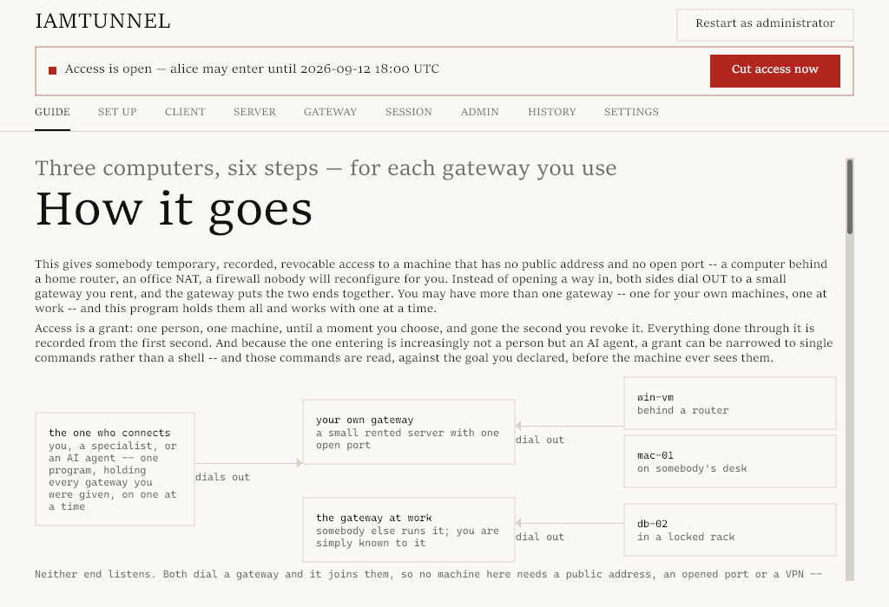

# iamtunnel

**Temporary, recorded SSH access to Windows machines behind NAT — for people and AI coding agents.**

[](LICENSE)
[](go.mod)

Handing out a permanent VPN or a standing admin account for a one-time fix
is how "temporary" access quietly becomes forever. iamtunnel grants access
for a specific window, records everything that happens, and closes the door
itself the moment the grant ends or is revoked — no cleanup step to forget.

<picture>
  <source media="(prefers-color-scheme: dark)" srcset="docs/screenshots/guide-dark.png">
  
</picture>

## Features

- **Time-boxed grants.** `person → machine, until T`, as a full shell or as
  exec-only (single commands, judged one at a time). Revoke, extend or
  narrow access at any moment; revoking kills live sessions immediately.
- **No standing access.** The machine's "door" — its own
  `administrators_authorized_keys` entry — exists only while a grant is
  live, opened and closed by the gateway itself.
- **Every session recorded.** An asciicast, a readable text transcript, and
  metadata for shells and PTY exec; a lossless JSON stream for
  no-PTY exec. The machine's owner and the admin can watch a session live. The
  audit journal is hash-chained and independently verifiable.
- **A risk gate for AI agents and automation.** Exec commands pass a
  classifier — local rules and/or an optional hosted AI classifier (off by
  default; see [what it receives](docs/AI-AGENTS.md#what-the-external-classifier-receives)) — judged
  against the goal declared for the grant and recent command history. Red
  commands are held for human approval or blocked outright.
- **No TOFU, anywhere.** Every fingerprint is pinned from a signed string:
  the gateway's key from the connection string and enrollment code, a
  machine's host key at registration. Enrollment uses one-time codes;
  additional admins pair with a PIN.
- **One binary, four roles.** Client, server, admin, and gateway are all
  the same binary — a desktop GUI and a full CLI, both driving the
  same underlying commands.

## How it works

```
   client                    gateway                    server
 (the person,     ──ssh──▶  a small VPS,   ◀──ssh── (the Windows/Linux/
  or an AI agent)           one open port           macOS machine, no
                                                     inbound ports needed)
```

Neither the client nor the server ever listens for a connection. Both dial
out to the gateway, which sits on a small public VPS with one open port and
introduces the two sides to each other. The gateway is the only party that
ever sees a session in plaintext, which is exactly why it's the one that
records it.

## Quick start

**1. Install the gateway** on a clean Ubuntu VPS:

```bash
sudo iamtunnel gateway install --public-host gw.example.com
```

This prints a one-time bootstrap link.

**2. Claim the first admin**, from your own machine, using that link — paste
it into the GUI's Admin → Join tab, or:

```bash
iamtunnel admin claim gw.example.com:2222#<fingerprint>:<token> --key "$(cat ~/.ssh/id_ed25519.pub)"
```

**3. Enroll a Windows machine.** As the admin, issue an invitation:

```bash
iamtunnel admin machines enrol-code win-srv01
```

On the Windows machine, as administrator:

```powershell
iamtunnel enrol "iamtunnel-enrol://gw.example.com:2222#<fingerprint>:<secret>"
iamtunnel server install
```

**4. Add a person, grant access, connect.** The person prints their public
key with `iamtunnel client key`; the admin adds them and grants access:

```bash
iamtunnel admin people add alice --key "ssh-ed25519 AAAA... alice"
iamtunnel admin people connection-string alice
iamtunnel admin grants grant alice win-srv01 2026-12-31T00:00:00Z --cap shell
```

Alice saves the connection string the admin sent her and connects:

```powershell
iamtunnel client connect-string "iamtunnel://gw.example.com:2222/alice#<fingerprint>"
iamtunnel client connect win-srv01
```

See `docs/USER.md` for the full walkthrough, including Linux and macOS
machines, and `docs/RUNBOOK.md` for the operator's side of every step.

## Using it with AI coding agents

An exec-only grant, a declared goal, and a risk classifier standing between
an agent and the machine — see [docs/AI-AGENTS.md](docs/AI-AGENTS.md) for
how to give an agent access, how commands get judged, and what an agent
should expect when a command is held for approval.

## Security model

The gateway terminates SSH on both ends, which is what lets it record
sessions — and it's also the trust boundary: a fully compromised gateway can
see live sessions and issue unauthorized door-open requests. Every other
compromise scenario (a stolen admin key, a lost laptop, a compromised
machine, an on-path attacker) is walked through in detail, including exactly
what an attacker gets and doesn't get, in [docs/THREATS.md](docs/THREATS.md).

## Limitations

Read these before relying on iamtunnel for something that matters:

- **SSH only** — no RDP, no databases, no other protocols. The target
  machine needs Windows OpenSSH (or, on Linux/macOS, an ordinary sshd).
- **A single gateway, no HA.** If it's down, nothing connects through it.
- **No SSO/SAML/OIDC yet.** People and admins authenticate with SSH keys.
- **The AI classifier is a second layer, not a guarantee.** It catches
  carelessness and clearly bad outcomes, not a determined adversary who
  knows how it works — see `docs/AI-AGENTS.md` and `docs/THREATS.md`.
- **A young project maintained by one person.** Expect rough edges; see
  `SECURITY.md` for how to report problems.

## Building from source

Requires Go 1.27+. To install straight from the module:

```bash
go install -tags nogui github.com/ultrathinker/iamtunnel/cmd/iamtunnel@latest   # headless, any OS
go install github.com/ultrathinker/iamtunnel/cmd/iamtunnel@latest               # with the GUI
```

Or from a clone:

```bash
go build -o iamtunnel ./cmd/iamtunnel        # full build, with the GUI
go build -tags nogui -o iamtunnel ./cmd/iamtunnel   # headless build (for the gateway)
```

The full build's GUI ([Gio](https://gioui.org)) needs cgo on Linux and
macOS (talking to X11/Wayland or Cocoa; on Linux also the X11, Wayland,
Vulkan and EGL development packages listed in `CONTRIBUTING.md`); Windows needs no cgo for either
build. The headless build (`-tags nogui`) drops the GUI package entirely and
never needs cgo anywhere — it's what should run on a gateway. See
`CONTRIBUTING.md` for the full dependency list and the test/gate suite.

## License

[Apache License 2.0](LICENSE). See [NOTICE](NOTICE) for attribution.
