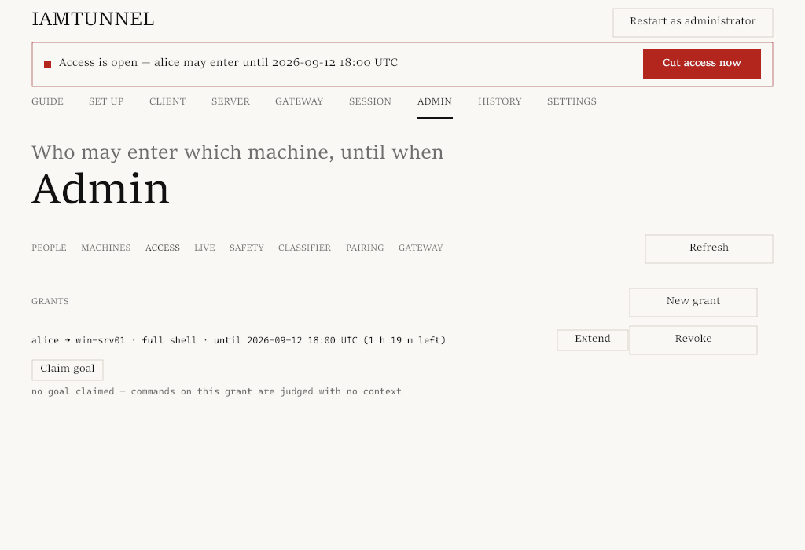
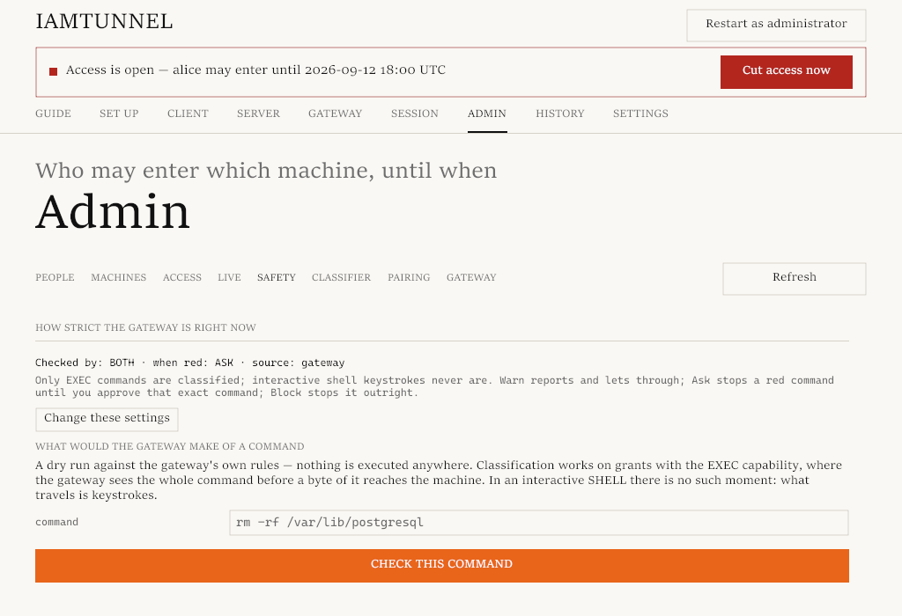
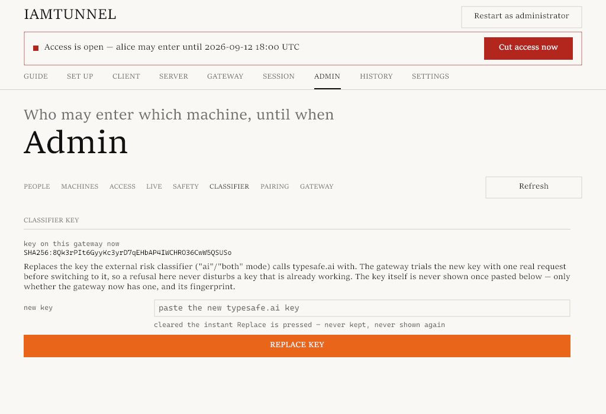

# Using iamtunnel with AI coding agents

An AI coding agent (Claude Code, Codex, or similar) needs the same thing a
human contractor does: temporary, narrow, recorded access to a machine it
doesn't own. iamtunnel was built with this case in mind from the start — not
bolted on afterward.

## Why this is different from just giving the agent SSH

Handing an agent a raw SSH key is the usual shortcut, and it has the usual
problems: the access doesn't expire on its own, no one reviews commands
before they run, and if something goes wrong there's no recording to check.
iamtunnel's gateway sits in the middle of every connection and enforces
three things a bare SSH key can't:

- **A deadline.** The grant ends at a time you chose, enforced by the
  gateway's own clock — not the agent's, and not something the agent can
  extend itself.
- **A command gate.** Every command the agent runs can be checked against
  rules and/or an external AI classifier *before* it ever reaches the
  machine — not logged afterward, gated beforehand.
- **A full recording.** Every command and its output is written to the
  gateway, independent of the agent's own logs, and the machine's owner can
  watch it live.

## Setting up the grant

Give the agent an **exec-only** grant, not a shell grant (the Admin tab's
**Access** sub-tab does the same from the window):



```
iamtunnel admin grants grant <agent-person> <machine> <until-ISO8601|""> --cap exec
```

`exec` is the default when `--cap` is omitted, and that's deliberate: it's
the one kind of access the gateway can see and judge *before* it reaches the
machine. A shell grant (`--cap shell`) hands over an interactive terminal —
a stream of bytes with no command boundary — which no safety mode can
inspect. Give an agent a shell grant only if you're prepared to review the
whole session yourself; for unattended or semi-unattended agent work, exec
is the access this feature exists for.

Declare what the agent is there to do:

```
iamtunnel admin goal set <agent-person> <machine> --goal "restart the payment worker and confirm the queue drains"
```

The goal is stored per (person, machine) pair, has no expiry, and is sent
along with every classified command — it's how the classifier tells
"restarting a stuck service" from "restarting a service" as an open-ended
license to do anything. A goal that just claims breadth ("do whatever's
needed", "full access") gives the classifier nothing to work with and is
never treated as an exception on its own.

## What the agent actually runs

Nothing special. From the agent's side this is plain `ssh`/exec usage —
there is no iamtunnel-specific SDK or wrapper to install on the agent side:

```
iamtunnel client exec <machine> -- <command>
```

The `--` is required; everything after it is passed through verbatim, with
no flag parsing by iamtunnel itself. The command's own stdout and exit code
come back as normal; the gateway's own words (the recording notice, a risk
warning, a block) go to stderr, never mixed into the command's stdout — so
the agent's own output parsing doesn't have to account for iamtunnel at
all.

One deliberate restriction: an exec-only grant carries no standard input.
The gateway closes the machine's stdin right after forwarding the command,
so an agent that runs an interpreter by name with no script argument
(`python`, `powershell`, `bash`) gets a program that immediately sees
end-of-input, not a hidden shell it can drive interactively. Pass data the
way the command itself supports — a filename argument or an input file the
command opens itself.

The GUI's Client tab generates a ready-made prompt block for exactly this
setup — the connection command, the machine name, and the goal text — meant
to be pasted straight into an agent's system prompt or task description, so
setting an agent loose on a grant doesn't require hand-writing this each
time.

## How the classifier and ask mode work

Every exec command is classified before it's forwarded, using local rules
and/or an external AI classifier (`risk_classifier`: `rules`, `ai`, or
`both`). Classification weighs the command against the grant's declared
goal and the pair's recent command history — it asks whether the command
destroys data, changes who can reach the machine, falls outside the
declared work, or weakens the machine's own defenses (including means of
recovery). History can only raise concern, never lower it on its own; only
work that plainly continues the declared goal lowers it.

The admin picks the checkers and the ladder on the Admin tab's **Safety**
and **Classifier** sub-tabs:





### What the external classifier receives

The default source is `rules`: the gateway's own patterns, and nothing
leaves the gateway. Only `ai` and `both` call the hosted classifier, which
is the TypeSafe service at `https://api.typesafe.ai/v1/systemone`, reached
with the key the admin stores (`iamtunnel admin risk key`). For each exec
command the request carries:

- the command itself;
- the grant's declared goal;
- the pair's recent-command history: earlier commands, their exit status,
  and the first lines of what the machine answered.

Every field is scrubbed of recognisable secrets before it is stored or
sent (THREATS.md describes the scrubbing and its limits), but scrubbing is
pattern-based, not a guarantee. Turn on `ai` or `both` only if you accept
sending that text to a third party, and read the provider's terms and
privacy policy first. With `rules`, no command text ever leaves your
gateway.

The admin sets one ladder for what happens next, `risk_action`:

- `log` — journals both yellow and red, runs the command anyway.
- `warn` — same, plus a warning shown to the agent before the command runs.
- `ask` — yellow runs with a warning; **red stops before it reaches the
  machine** and waits for a one-time human approval.
- `block` — yellow warns, red is refused outright.

## What to expect when a command is held

Under `ask`, a red command never reaches the machine. The agent (or the
person watching its output) sees a machine-readable `approval-id` and
`E_APPROVAL_REQUIRED`; the exit code is `126`. A human approves with:

```
iamtunnel admin risk approve <approval-id>
```

...and then the agent must run the **exact same command string** again —
the approval is tied to the person, machine, and full command text, expires
in 5 minutes, and burns after one matching run.

Read this boundary honestly, because it matters for how much trust to put
in it: an approval is signed with the same key that signed the command
itself. At the gateway's level, "a human approved this" and "the agent
approved its own held command" are indistinguishable — if the agent (or
something running alongside it) knows the approval command and has a key
that can run it, it can clear its own red commands. `ask` is a safety net
against carelessness and unattended automation running off the rails — a
command that gets a human's eyes on it before running, an agent that took a
wrong turn — not a defense against an agent (or a person) that specifically
sets out to defeat it. If that stronger guarantee matters for your case, use
`block`, or have a human outside the machine hold the only key capable of
running `risk.approve`.

## Why the gate lives on the gateway, not in the agent

An agent's own guardrails — a system prompt telling it to be careful, a
wrapper script that double-checks commands — run on hardware the agent (or
whoever compromised it) controls. Any check that lives there can be edited,
bypassed, or silently skipped by the same process it's supposed to
constrain. The classifier and the ask/block gate run on the gateway,
outside the agent's reach: the agent can refuse to cooperate with the gate,
but it cannot edit the gate, disable it, or see what rule fired beyond what
the refusal message tells it. Whatever the agent is running on — a
developer's laptop, a CI runner, a compromised dependency — the enforcement
point is a separate machine it was never given the keys to.

This is also why the classifier is described as a second layer, not a
guarantee, throughout this project's own documentation (see `THREATS.md`
§3.14–§3.15): it catches carelessness and clearly-declared bad outcomes,
not a determined adversary who has fully compromised the agent's host and
knows exactly how the gate works.
