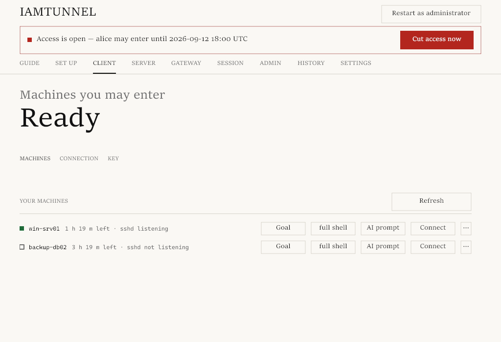
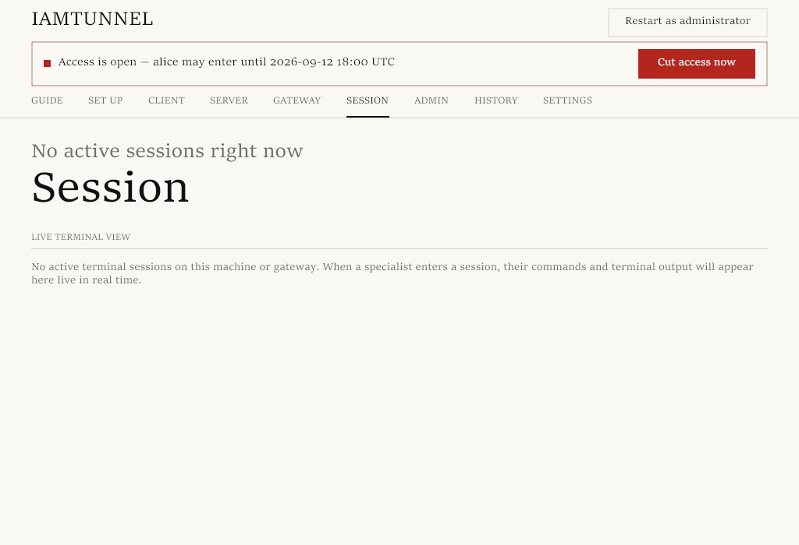
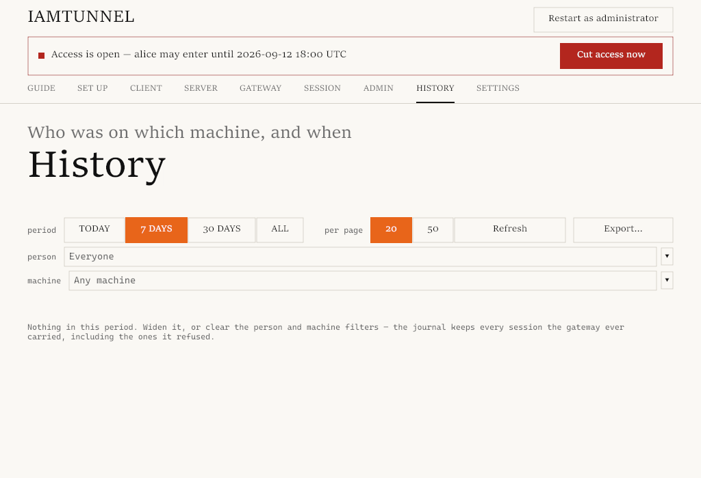

# iamtunnel user guide

## Commands with risk checking

If you were given `exec` access, every command you run is checked before it
reaches the machine. A yellow result shows a warning, but the command still
runs — yellow means "this changes something," not an alarm. A red result may
be stopped by the machine owner's chosen mode: the message names the rule
and the reason, and exit code `126` means the gateway never forwarded the
command to the machine at all. Interactive `shell` access is never checked
this way, because it has no reliable single-command boundary.

If a command you needed gets blocked by mistake, there's no workaround right
now: save the warning or block text and tell the machine's owner — they can
check the reason against the session history and decide whether to change
the mode or do the work another way. Before you start, you can safely test a
command ahead of time: `iamtunnel admin risk check "<command>"` sends it to
the gateway and evaluates it under the same rules a real session would use.

## 1. What this is

Sometimes your computer or server needs a specialist's help — setting up a
program, updating a database, fixing something broken. Normally that means
handing over a password or leaving standing remote access that's easy to
forget about. iamtunnel does it differently: you grant access for a strictly
limited window (say, a couple of hours), and it turns itself off afterward,
leaving no standing access behind. The recording of the session stays, as
section 5 explains.

The core idea is full transparency and safety. Everything that appeared on
screen while the specialist worked on your machine is continuously
recorded — **including a password, if it was ever visible in plain text on
screen**; the exact rule is in section 5. Nothing can be done out of sight.
The moment the time runs out, or the specialist finishes, access closes
instantly, and you're left with a fully secured computer.

---

## 2. I want to let someone in

To grant an engineer or administrator access to your Windows computer,
follow these steps.

**One rule before you let anyone in.** While the specialist works, everything
visible on screen is continuously recorded — including a password, if it's
visible at that moment: typed in plain text at a command prompt, written in
a file that's open on screen, or printed in some command's output. If a
password is masked with dots or asterisks as you type it, it never enters
the recording. Details are in section 5.

### Step 1. Prepare the program
Put `iamtunnel.exe` on the server or computer that needs access, in a
`C:\iamtunnel` folder, locked down so only administrators can change it. From
an **administrator** PowerShell prompt, in the folder holding the downloaded
file, run:
```powershell
New-Item -ItemType Directory -Force "C:\iamtunnel" | Out-Null
icacls "C:\iamtunnel" /setowner "*S-1-5-32-544" /T /C /Q
icacls "C:\iamtunnel" /inheritance:r /grant:r "*S-1-5-18:(OI)(CI)F" "*S-1-5-32-544:(OI)(CI)F" "*S-1-5-32-545:(OI)(CI)RX" /Q
Get-ChildItem "C:\iamtunnel" -Force | ForEach-Object { icacls $_.FullName /reset /T /C /Q }
Copy-Item .\iamtunnel.exe "C:\iamtunnel\iamtunnel.exe"
```
Run the program from there from now on: `C:\iamtunnel\iamtunnel.exe`.

Why not the desktop or "Downloads": once set up, the program installs its
own autostart, which runs it **with administrator rights on every logon,
with no prompt at all**. If the file sits somewhere that anything other than
an administrator could replace — another program running as you, or another
person on the same computer — a swapped file would get administrator rights
at the next logon. So the program refuses to set up autostart from such a
folder and names who could change the file. A `C:\iamtunnel` folder created
without these commands is writable by anyone who can log into the
computer — that's a property of the `C:` drive's root, not of the program.

### Step 2. Get a setup code
Whoever is going to connect, or your system administrator, will send you a
one-time setup code. It looks like a long text string:
`iamtunnel-enrol://gateway-address:port#verification-code:secret-code`
This is **one whole string** — copy and paste it as one piece. There's no
need to split it into parts anywhere.

**The code works for 15 minutes and only once.** It used to live a full day —
and that was exactly its weak point: the secret sat in someone's inbox for a
day. So ask for the code when you're already at the computer and ready to
paste it right now, not an hour ahead. If it expires, ask for a new one —
one click for the administrator.

**You won't need to give your own account name.** It used to be that the
administrator had to find out your computer's name and your Windows account
name (like `DOMAIN\user`) ahead of time and enter them when issuing the
code. Not anymore: your computer reports its own account the moment the
code is used. The **registration name** — a short label like `office-pc` —
is the administrator's own choice; you're not asked about it, and you'll
see it in the program after setup.

**If several people use this computer** — say, two or three people RDP into
a shared server — each person sets themselves up **separately, under their
own account**: their own code, their own name, their own setup. They don't
interfere with each other and can work at the same time. A side benefit:
the journal shows exactly who did what, not just "someone on this computer".

### Step 3. Run the program as administrator
Right-click `iamtunnel.exe` and choose **"Run as administrator"**. This is
required, since the program needs system rights to temporarily set up
secured Windows access. From the console, `server start` without these
rights exits with code 4 and prints
`iamtunnel server start: administrator privileges are required — close this
console and run it using "Run as administrator".`; the program itself
doesn't trigger a UAC prompt.

If you already opened the program the ordinary way, you don't need to close
it: in the window's top-right corner, next to the title, there's a small,
unlabeled button that pulses slowly. That's "restart with administrator
rights"; once rights are granted, the button disappears. The old red "
administrator rights required" bar under the tabs is gone — it used to sit
on every screen, including ones where rights didn't matter. Now, if a
button didn't work because of rights, the program says so in a line right
under that button.

### Step 4. Activate the setup code
- **In the window:** go to the **Set up** tab, paste the code into the
  single field, and press the button. Before anything happens, a short line
  appears under the field: "what will happen now" — the action, which
  server, and its verification fingerprint. **Read it.** This is the one
  moment you can notice a wrong string or the wrong window; pasting alone
  does nothing.
- **From the command line (administrator PowerShell):** run:
  ```powershell
  & "C:\iamtunnel\iamtunnel.exe" enrol "YOUR_SETUP_CODE"
  ```
The program contacts the gateway and confirms its identity. Wait for a
success message.

### Step 5. One command to finish
Once setup succeeds, turn on autostart. **The window doesn't have a button
for this yet** — do it with one command, in the same administrator
PowerShell window (see below). After this, the computer comes online on its
own — every time you log in, remote desktop included — with no need to keep
the program's window open.

The **Start** button on the **Server** tab only starts the server **for
this session** — it won't come back after a reboot. That's not the same as
autostart.

The autostart this creates is **yours personally**: it fires when you
specifically log in, and runs under your own account. A colleague on the
same computer has their own, separate one. No password is stored anywhere.

This isn't a formality. If you stop at pressing **Start**, everything looks
fine — until the next morning, after a reboot, when "the computer is
connected" stops being true.

The command:
```powershell
& "C:\iamtunnel\iamtunnel.exe" server install
```

### How many steps is this now
**Before:** tell the administrator your computer's name and your Windows
account name (usually something you had to go find out), paste the code,
switch tabs, press **Start** — and end up with a setup that stopped being
true after the very next reboot. All of this, once per computer, leaving no
room for a second person on the same machine.

**Now:** paste one string, read what it's about to do, press the button —
and run one command at the end. No name typed by hand, a result that
survives a reboot, and as many setups on one computer as there are people
working on it.

### What you'll see, and what the person connecting will see
- **You'll see:** in the window, a green activity indicator and a note that
  the computer is online and waiting for a connection. From the command
  line, the program reports a successful start and goes into waiting mode.
- **The specialist will see:** on their own computer, your server's name in
  the machine list, marked "online", with a timer showing how much time is
  allowed.
- **How long this takes:** the whole process, from downloading the file to
  being fully ready, takes about two minutes.

### If your computer runs Linux

Everything is the same, just without a window: commands run in a terminal
and need root (`sudo`) — the program needs to add a key, once, to the login
file of whichever Linux account specialists will use on this machine, and
that's done by the machine's own administrator. Detailed instructions for
an administrator are in RUNBOOK §1.7; below is the short version.

**Step 1. Prepare the program.** Put `iamtunnel` (no `.exe`) on the machine
and make it executable:
```bash
sudo install -m 0755 iamtunnel /usr/local/bin/iamtunnel
iamtunnel version
```

**Step 2. Get a setup code.** The same kind of one-time code as above: valid
for **15 minutes**, once. The administrator doesn't ask for your Linux
account name — the machine reports it itself when the code is used; they
choose the registration name themselves. Unlike Windows, on Linux setup is
**one per machine** — the service runs as root, and it has no person.

**Step 3. Activate the setup code** (without root the command refuses and
suggests `sudo`):
```bash
sudo iamtunnel enrol 'iamtunnel-enrol://gateway-address:port#verification-code:secret-code'
```

**Step 4. Turn on waiting mode.** One command, exactly like step 5 above on
Windows, and this is the right way to do it:
```bash
sudo iamtunnel server install
```
This sets up the `iamtunnel-machine` system service, enables it, and starts
it right away; it comes back on its own after a reboot. To remove autostart:
`sudo iamtunnel server uninstall` (access and registration are kept).

A one-off `sudo iamtunnel server start` also works, but remember what's
different about it: it runs until you stop it (Ctrl+C, or
`sudo iamtunnel server stop` from another terminal), and it **does not
survive a reboot** — afterward the machine stops being connected, even
though everything looks set up.

**Step 5. Check that it's working.**
```bash
sudo iamtunnel server status
```
`running` means the program is up and listening; once it connects to the
gateway, the specialist will see your machine in their list, marked
"online".

**How to stop it.** `sudo iamtunnel server stop` — an ordinary stop, access
closes immediately; with autostart enabled, the service stays enabled and
comes back at the next reboot.

**What the specialist will see.** They log in as the Linux user you told the
administrator about — not as root. Session recording follows the same rules
as section 5: whatever was visible on screen is recorded, passwords shown in
plain text included.

**A menu/desktop shortcut.** Running the program from a terminal doesn't add
an icon to your desktop's application menu (GNOME, KDE, XFCE…) — on Linux,
setting up that icon is its own separate step. Do it once, as your normal
user (no `sudo`):
```bash
iamtunnel desktop install
```
This writes `~/.local/share/applications/iamtunnel.desktop` and two icons
into `~/.local/share/icons/hicolor/`. iamtunnel then shows up in your
application menu and dock, like other programs. It only writes to your own
home directory — no `/usr/share/applications`, no `/usr/share/icons`, no
`sudo`. To remove it: `iamtunnel desktop uninstall`.

**If something didn't work:**
- `root privileges are required` — you ran the command without `sudo`;
  repeat it with `sudo`.
- `sshd on 127.0.0.1:22 is not reachable` — the remote-login service isn't
  running: `sudo systemctl start ssh` (on some systems it's named `sshd`),
  and `sudo systemctl enable ssh` so it survives a reboot.
- `this machine is not registered` — the setup code hasn't been activated
  yet: run step 3 (`enrol`) before `install`/`start`.
- Access doesn't work even though the commands succeeded — the program
  prints the reason; most often it's home-directory permissions: OpenSSH
  won't read the login file if the home directory, the `.ssh` folder, or
  the file itself are writable by anyone but the owner. iamtunnel
  deliberately doesn't "fix" these permissions — otherwise the key would
  stay invisible to login with no visible cause.

### If your computer runs macOS

Same order as Linux: terminal commands, root via `sudo`, and the same
"Remote Login is on" check. But two things that other systems handle
automatically need a human's help on macOS — and that's the only thing that
can trip you up.

Running the program with no arguments opens the same window as on Windows
and Linux; the labels, tabs and buttons are the same. Two buttons behave a
bit differently on a Mac, and it's obvious right away:

- **Connect** opens a **Terminal.app** window running `client connect` —
  the same as the command window that opens on Windows. Nothing needs to be
  typed into it; session recording follows the same rules.
- **Restart with administrator rights** — the same small, unlabeled,
  slowly-pulsing button in the top-right corner as on Windows; it
  disappears once rights are granted. On a Mac it shows the standard macOS
  rights prompt (the same one you see installing other software).
  Cancelling it means the window keeps running as before and reports that
  rights weren't granted — in a line under the button you pressed.

**Step 1. Turn on "Remote Login".** Open **System Settings → General →
Sharing** and turn on **Remote Login**. From the terminal, the same thing:
```bash
sudo systemsetup -setremotelogin on
```
While it's off, the program can't open access at all: there's no way to
confirm the computer answers on `127.0.0.1:22`, and the command refuses,
pointing at this switch.

**Step 2. Prepare the program.** Put `iamtunnel` (no `.exe`) on the machine
and make it executable:
```bash
sudo install -m 0755 iamtunnel /usr/local/bin/iamtunnel
iamtunnel version
```

**Step 3. Get a setup code** — the same one-time code as above: valid for
**15 minutes**, once. Your macOS account name isn't asked for — the machine
reports it itself; the registration name is the administrator's own choice.
As on Linux, setup here is **one per machine**.

**Step 4. Activate the setup code** (without root the command refuses and
suggests `sudo`):
```bash
sudo iamtunnel enrol 'iamtunnel-enrol://gateway-address:port#verification-code:secret-code'
```

**Step 5. Turn on waiting mode.** Two options:
- **One-off, by hand** — `sudo iamtunnel server start`. Runs until you stop
  it (Ctrl+C, or `sudo iamtunnel server stop` from another terminal).
- **With autostart** — better for a machine that should always be reachable:
```bash
sudo iamtunnel server install
```
This sets up the `com.iamtunnel.machine` system service
(`/Library/LaunchDaemons/com.iamtunnel.machine.plist`), loads it, and
starts it right away; it comes back on its own after a reboot, and
restarts on a crash (but an ordinary stop isn't undone by a restart). To
remove autostart: `sudo iamtunnel server uninstall` (access and
registration are kept).

**Step 6. Check that it's working.**
```bash
sudo iamtunnel server status
```
`running` means the program is up and listening; once it connects to the
gateway, the specialist will see your machine in their list, marked
"online".

**How to stop it.** `sudo iamtunnel server stop` — an ordinary stop, access
closes immediately; with autostart enabled, the service stays enabled and
comes back at the next reboot. You can also control the service through
launchd directly:
```bash
sudo launchctl kickstart -k system/com.iamtunnel.machine   # restart
sudo launchctl bootout system/com.iamtunnel.machine        # stop
```

**What the specialist will see.** They log in as the macOS user you told the
administrator about — not as root. Session recording follows the same
rules as section 5: whatever was visible on screen is recorded, passwords
shown in plain text included.

**If the key folder is protected.** macOS blocks some folders from ordinary
programs (Desktop, Documents, Downloads, iCloud Drive). If the file
iamtunnel writes temporary access into sits inside one of these, the program
needs **Full Disk Access**: **System Settings → Privacy & Security → Full
Disk Access** — add `iamtunnel` there. The ordinary setup (the login file in
your own hidden `.ssh` folder) doesn't need this at all; `enrol` and
`server start` remind you about it themselves whenever it's missing.

**If something didn't work:**
- `root privileges are required` — you ran the command without `sudo`;
  repeat it with `sudo`.
- `the Remote Login daemon is off` or `sshd on 127.0.0.1:22 is not
  reachable` — Remote Login is off: turn it on as in step 1.
- `this machine is not registered` — the setup code hasn't been activated
  yet: run step 4 (`enrol`) before `install`/`start`.
- `Operation not permitted` while handling the key file — Full Disk Access
  hasn't been granted (see above), and the door file is in a protected
  folder.
- Access doesn't work even though the commands succeeded — the program
  prints the reason; the same home-directory permission check as on Linux
  applies: OpenSSH won't read the login file if the home directory, `.ssh`,
  or the file itself are writable by anyone but the owner.

---

## 3. I was let in — what do I do

If you're a specialist given access to work on a remote server, there are
four steps.

### Step 1. Get your connection string
If you're not on the gateway yet, the administrator first needs your public
key. Open the program, go to the **Client** tab, **Key** sub-tab — the key
is already there, even if you haven't saved anything yet — and copy it with
the button. The same from the console: `iamtunnel client key`. Once the
administrator adds you (**Admin → People → Add person**), they get your
connection string right away and send it to you.

Your connection string looks like this:
`iamtunnel://gateway-address:port/your-name#verification-code`

### Step 2. Save the connection string
Run `iamtunnel.exe` on your own workstation.
- **In the window:** open the **Client** tab, **Connection** sub-tab, paste
  your string into the single field, and press the save button. A line
  appears underneath saying exactly what's about to happen and which
  server, with its verification fingerprint — read it before pressing.
- **From the command line:** run:
  ```powershell
  .\iamtunnel.exe client connect-string "YOUR_CONNECTION_STRING"
  ```
The program saves the gateway's details securely. This is a one-time step.

### If you have more than one gateway

A personal one for home machines and a separate one for work is a normal
setup, and you can keep as many as you like. The **Client** tab lists them:
the one you're on now is marked "in use", the rest show a **Use** button.

- **Add** — paste the second gateway's connection string into the form
  below the list, and name it if you like ("Work"). The first gateway isn't
  lost.
- **Switch** — one press on **Use**. Nothing to type, ever: this program has
  no passwords at all. The only check is your key — one per computer,
  already known to every gateway that lists you.
- **Forget** — the X at the end of the row. Your key stays where it is, and
  so does your record on that gateway: a client can always forget, only an
  administrator can revoke.

Gateways don't know about each other — the list only lives on your
computer. After switching, every list — machines, people, history — is
re-fetched from the new gateway from scratch; nothing from the old one
stays on screen, since it belongs to a different world.

The same from the terminal: `iamtunnel client gateways` (list),
`iamtunnel client use <name>` (switch), `iamtunnel client forget <name>`
(remove).

A special case — **an already-saved gateway now presents a DIFFERENT
key**. This isn't a new gateway — it's the same address with a new lock,
and there are only two honest explanations: the gateway was reinstalled, or
someone is standing between you and it. The program refuses to save this
silently and waits for you to find out which.

---

### Step 3. See the list of available servers
- **In the window:** the **Client** tab, **Machines** sub-tab, shows a table
  of servers you're allowed on, their connection status (online or off),
  and the exact time your access ends.

  
- **From the command line:** run:
  ```powershell
  .\iamtunnel.exe client machines
  ```

### Step 4. Connect to a server
- **In the window:** press the **Connect** button next to the server's name.
- **From the command line:** run:
  ```powershell
  .\iamtunnel.exe client connect server-name
  ```

### What appears, and how to tell it worked
Right after connecting, an ordinary black terminal window opens. The very
first line on screen is a mandatory system notice:
```text
This session is recorded. Machine win-srv01, until 2026-09-12T18:00:00Z.
```
This means: *"This session is being recorded. Server win-srv01, access
until 18:00:00 UTC."*

The remote server's familiar prompt (PowerShell or cmd) appears right after.
You're connected and can start working.

The window's **Session** tab shows the same session from the desktop app:



### If you were given access to specific commands only, not a full terminal

Sometimes an administrator issues narrower access: not a full server
terminal, but the right to run individual commands one at a time, with no
interactive session. In this case, the remote machine never sees a full
command prompt — the specialist sends the gateway one command, and the
gateway decides whether to let it through **before** it ever reaches the
server. This narrower access is also the **default**: if the administrator
didn't name a kind of access explicitly when issuing the grant, the
specialist gets individual commands, not a terminal. The default is the
stricter of the two — the one where every command gets checked.

**What this looks like.**
- **In the window:** such a server's row (Client tab) shows a command field
  and a **Run** button instead of Connect — there's no Connect button at
  all, since there's no point offering one that can't usefully be pressed.
- **From the command line:** `iamtunnel.exe client connect server-name`
  refuses immediately and plainly (code `E_SSH_SHELL_FORBIDDEN`) and
  suggests the command to use instead:
  ```powershell
  .\iamtunnel.exe client exec server-name -- command-with-arguments
  ```
  The two dashes before the command are required — everything after them is
  passed verbatim, with no flag parsing by iamtunnel itself.

**What happens to each command.** This is exactly the access described at
the very start of this guide, in "Commands with risk checking": every
command is checked before it reaches the machine and gets a green, yellow
or red verdict. In the window, the command's output and its verdict appear
right in the output field under the Run button; from the command line, on
screen, in the same order described above. If the machine isn't currently
connected, the command doesn't run at all, and the screen shows the
gateway's refusal — "Access to this machine is currently unavailable." —
not a connection-drop error.

**Why an ordinary session (via Connect) has no such check.** An interactive
terminal has no concept of "one command": the specialist types arbitrary
bytes, the program on the server reads them character by character, and
there's no clean boundary between commands — the gateway can't know ahead
of time what will be typed and run, so there's nothing to evaluate. A
single command (`exec`) is the one kind of access the gateway sees whole
before it ever reaches the server, and so the only one it can evaluate.

**A single command starts with no standard input.** Precisely because the
gateway must see the whole command, it doesn't carry interactive input into
such a session: the command starts on the server with input already closed,
and a program that reads "end of input" simply exits. This also defends
against a bypass: launching an interactive interpreter by name
(`powershell`, `bash`, `python` with no arguments) doesn't turn into a
hidden terminal — it simply has nothing to read. If you do write something
to such a session's stdin, the bytes never reach the server, and the
session ends with an `E_SSH_STDIN_FORBIDDEN` note and an on-screen hint.
Pass data the way the command itself supports: a filename argument
(`cmd /c type file`, `python script.py`) or an input file the command opens
itself.

---

## 4. How long it lasts, and how it ends

- **Access is strictly time-limited.** The exact duration (say, two hours,
  or until the end of the workday) is set when the grant is issued. Time is
  counted by the gateway's own precise clock, independent of your own
  computer's clock.
- **It ends automatically.** The moment the set time runs out, access shuts
  off on its own. Nothing needs to be done to end it.
- **Extending without a disconnect.** If the work doesn't fit the window,
  the administrator can extend the grant — the **Extend** button next to it
  (Admin → Access tab) or `iamtunnel admin grants extend`. An open
  connection is **not** dropped when extended: the session continues to the
  new deadline. The reverse also holds honestly: shortening the deadline
  acts like an early revoke, and an open session closes.
- **Early revocation.** The owner of the machine being worked on, or the
  system administrator, can revoke access at any moment — if the work
  finished early, or if there's any doubt about safety.
- **Renaming.** A typo in a person's name, or an awkward machine label,
  doesn't need deleting and starting over — the administrator renames it,
  with a **Rename** button next to the row (Admin → People and Admin →
  Machines tabs) or the commands `iamtunnel admin people rename` and
  `iamtunnel admin machines rename`. A person's permissions move to the new
  name entirely; a machine only changes its label — its id and every
  permission stay with it. A person's open connections close when their
  name changes: access continues under the new name.
- **What happens to an open window when access ends:** the connection drops
  instantly, the same second. A message appears in the terminal window
  about the session closing, due to expiry or revocation, after which the
  terminal closes or returns you to your local prompt. No further commands
  can be run on the remote server.

---

## 5. What gets recorded

- **Everything that appeared on screen is recorded.** A full text-video log
  is kept: every command run, its output, files viewed, error messages, and
  terminal window resizes. Playback shows exactly what the specialist saw,
  second by second.
- **The rule is simple: whatever was visible on screen goes into the
  recording — passwords included.** If a password was visible on screen at
  any point during the session, it's in the recording — no matter how it
  got there: typed in plain text at a command prompt, written into a file
  opened on screen, or printed by some command's output. Treat such a
  password as exposed, and avoid showing passwords on screen while a
  specialist is working unless there's no other way. Conversely: if a
  password is masked as you type it, showing only dots or asterisks, it
  never enters the recording — there's no separate keystroke capture in the
  program.
- **Where the recording is kept:** recording files are stored on the
  secured gateway, in a protected, isolated archive. They are never stored
  on the specialist's own computer. They may end up on the machine owner's
  computer, though — the owner (or the gateway's authorized system
  administrator) can export a copy at any time, during the session or
  after. "Stored on the gateway" doesn't mean "stored nowhere else".
- **Who can view a recording:** the archive is open only to the machine's
  owner and the gateway's authorized administrator. Neither the specialist
  nor anyone else has access to it. Besides the finished recording, the
  machine's owner can also watch a session **live, while the specialist is
  working** — opening the same program on their side shows the session's
  screen with almost no delay, not just the finished recording afterward.
  The specialist isn't told about this separately, by a one-time line or a
  persistent indicator — but the session's first line ("This session is
  recorded…", above) already says the main thing: everything visible on
  screen is recorded and can be read, and so it could also be watched right
  now. Whether someone actually watched live is recorded in the gateway's
  journal (a `session.watch` event) and visible to the administrator
  afterward — but don't rely on "I'll find out afterward if someone was
  watching"; it's safer to assume the screen could be watched at any
  moment.

### How to read a recording afterward

The **History** tab shows every past visit as one row: when, who, which
machine, how it ended, which commands were flagged risky. Filters at the
top: person, machine, period; results come 20 or 50 rows per page.



- **The "Transcript" button** on a row opens a separate window with that
  visit's full readout: everything that was on screen (for a terminal
  session), or the command with its output (for a single command). The
  window can be expanded and left open.
- **The "Export…" button** above the list exports **everything matching the
  current filters**, not just the visible page. The program asks for a
  folder — the suggested name already includes the person, machine and
  date — and writes:
  - `index.txt` — one line per session;
  - `all.txt` — every transcript concatenated, with a header over each: this
    is "the whole conversation with one person" or "everything over a
    period" in one file, convenient for reading or analysis;
  - a separate `.txt` file per session.

Recordings are kept for ninety days, sooner if space runs short; the visit
journal lives longer than that. So an old row's transcript may already be
gone — the program says so plainly rather than showing an empty window.

---

## 6. When something goes wrong

### 1. Message: OpenSSH service isn't running
- **What you see:** pressing Start on the server shows an error about the
  remote-login service (`sshd`) check.
- **What to do:** the standard OpenSSH service should be running on the
  Windows computer. Open an administrator PowerShell and start it:
  ```powershell
  Start-Service sshd
  ```
  To make it always start after a reboot:
  ```powershell
  Set-Service -Name sshd -StartupType Automatic
  ```
  Then start iamtunnel again.

### 2. Message: administrator rights required
- **What you see:** from the console, `server start` exits with code 4 and
  prints: `iamtunnel server start: administrator privileges are required —
  close this console and run it using "Run as administrator".`
- **What to do:** close this console, open PowerShell with **"Run as
  administrator"**, and repeat the command. The console path doesn't
  trigger a UAC prompt on its own; rights are needed to temporarily allow,
  and then reliably remove, access on Windows.

### 3. Message: the setup code is invalid or expired
- **What you see:** an error while entering the setup code during machine
  setup.
- **What to do:** the setup code is one-time, and **its lifetime is 15
  minutes**. If more than fifteen minutes passed since it was issued, or it
  was already used, it no longer works — ask the administrator for a new
  one; for them it's one click, no questions about names or accounts. The
  short lifetime is deliberate: this string is a key to your computer and
  shouldn't sit in a message for a whole day.

### 4. Message: the gateway's identifying mark has changed
- **What you see:** on connecting, the program shows a warning: *"the
  gateway host-key fingerprint changed: expected <expected>, got <got> —
  obtain a new connection string from the administrator"*.
- **What to do:** this is a system message meaning the server's security
  fingerprint no longer matches the one saved earlier. The program
  deliberately blocked the connection for your safety (for example, if the
  gateway was moved to new hardware or reconfigured). Ask the administrator
  for an updated connection string and save it with the replace flag:
  ```powershell
  .\iamtunnel.exe client connect-string "NEW_STRING" --replace
  ```

### 5. Message: access to this machine is currently unavailable
- **What you see:** trying to connect, the terminal shows: *"Access to this
  machine is currently unavailable"*.
- **What to do:** this means one of three usual situations:
  1. iamtunnel isn't running on the target computer, or Start hasn't been
     pressed there. Ask the machine's owner to start the program.
  2. Your granted access has expired. Check its status in the machine list
     (`iamtunnel client machines`) and ask the administrator to extend it
     if needed.
  3. The computer is off, or its internet connection dropped.

### 6. Message: too many login attempts (temporary lockout)
- **What you see:** connecting shows an error about exceeding the login
  attempt limit.
- **What to do:** the security system automatically applies a 15-minute
  lockout after too many failed login attempts in a row. Wait exactly 15
  minutes without trying to connect. Confirm with the administrator that
  your key is registered correctly, then try again.
